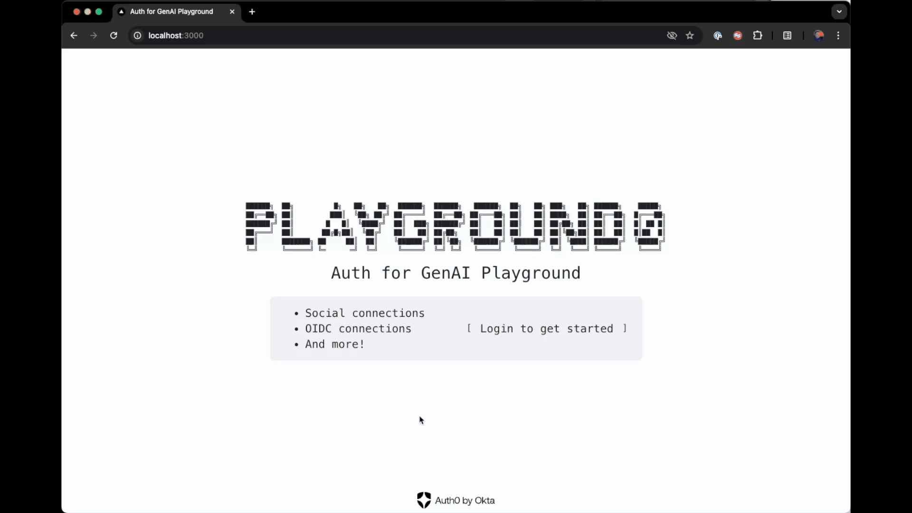

Playground0 is a demo chatbot AI agent app showcasing Auth0's integration capabilities with various third-party services using Auth for GenAI ([auth0.com/ai](https://auth0.com/ai)).



Checkout the [auth0.com/ai](https://auth0.com/ai) for SDKs, quickstarts, and more.

### Features:
- Account linking with social and OIDC connections
- Support for Salesforce, GitHub, Google Calendar, Spotify, and more
- Real-time chat interface backed by an LLM
- Profile management example
- Coming soon: Unlink and relink accounts
- Coming soon: Support for more services
### Credits:
Built with Next.js, Vercel AI SDK, Auth0 Auth for GenAI, and various third-party APIs. Icons by Lucide and Heroicons.

To get this going:

`git clone git@github.com:karanchhina/playground0.git`

`cd ./playground0`

Update your `.env.local` file with the following
```
OPENAI_API_KEY=<openai api key>

AUTH0_DOMAIN='genai-xxxxxxxxxxxx.us.auth0.com'
AUTH0_CLIENT_ID='<auth0 client id>'
AUTH0_CLIENT_SECRET='<auth0 client secret>'
AUTH0_SECRET='<random secret, e.g. openssl rand -hex 32>'
APP_BASE_URL=http://localhost:3000
AUTH0_M2M_CLIENT_ID='<auth0 client id for mgmt api scoped to get users and more>'
AUTH0_M2M_CLIENT_SECRET='<auth0 client secret for mgmt api scoped to get users and more>'

SALESFORCE_INSTANCE_URL=<e.g. https://xxxxxxxx.my.salesforce.com>
```

`npm i`

`npm run dev`

Note*** you need to have Auth0 configured with a tenant supporting Auth for GenAI, necessary application and connections (github, google, sfdc, etc.) configured. Checkout the quickstarts and how-tos at [auth0.com/ai](https://auth0.com/ai)

> **⚠️ Disclaimer**
> This code is provided for demonstration purposes only. It is not intended for production use.
> We provide no warranties or guarantees. Use at your own risk.
